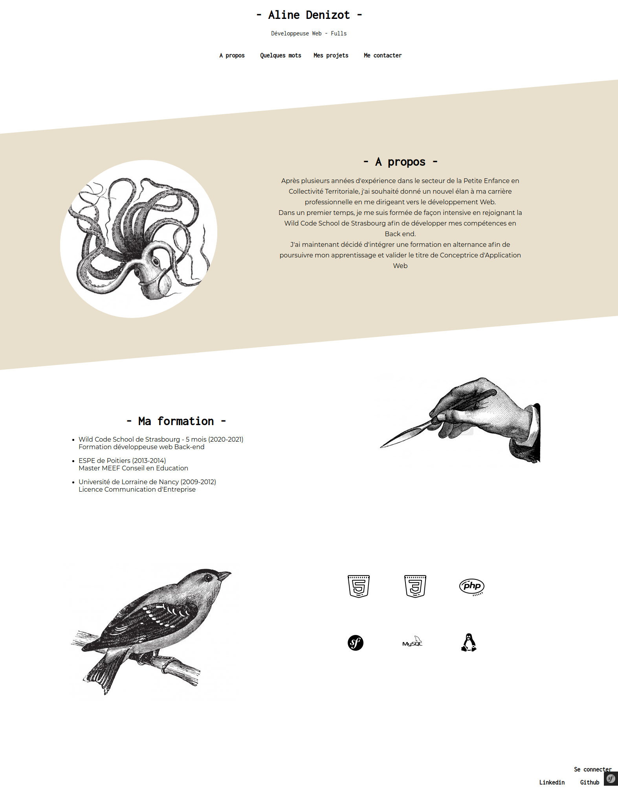
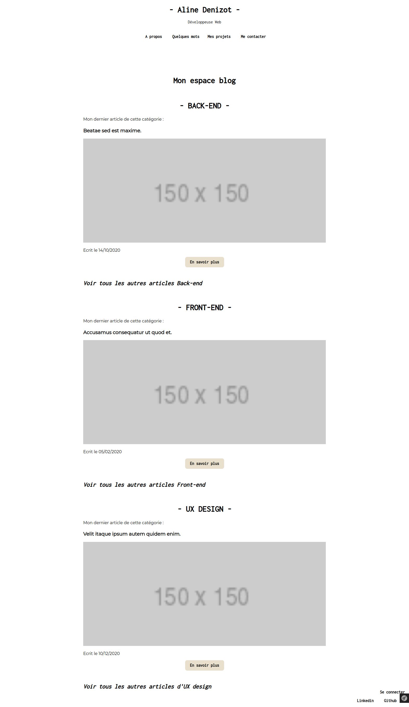
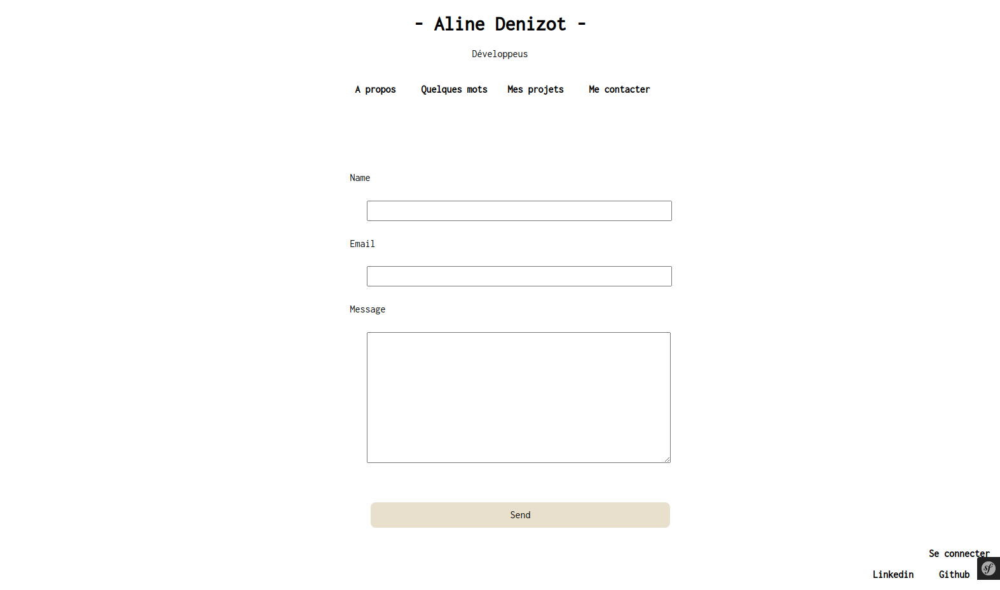
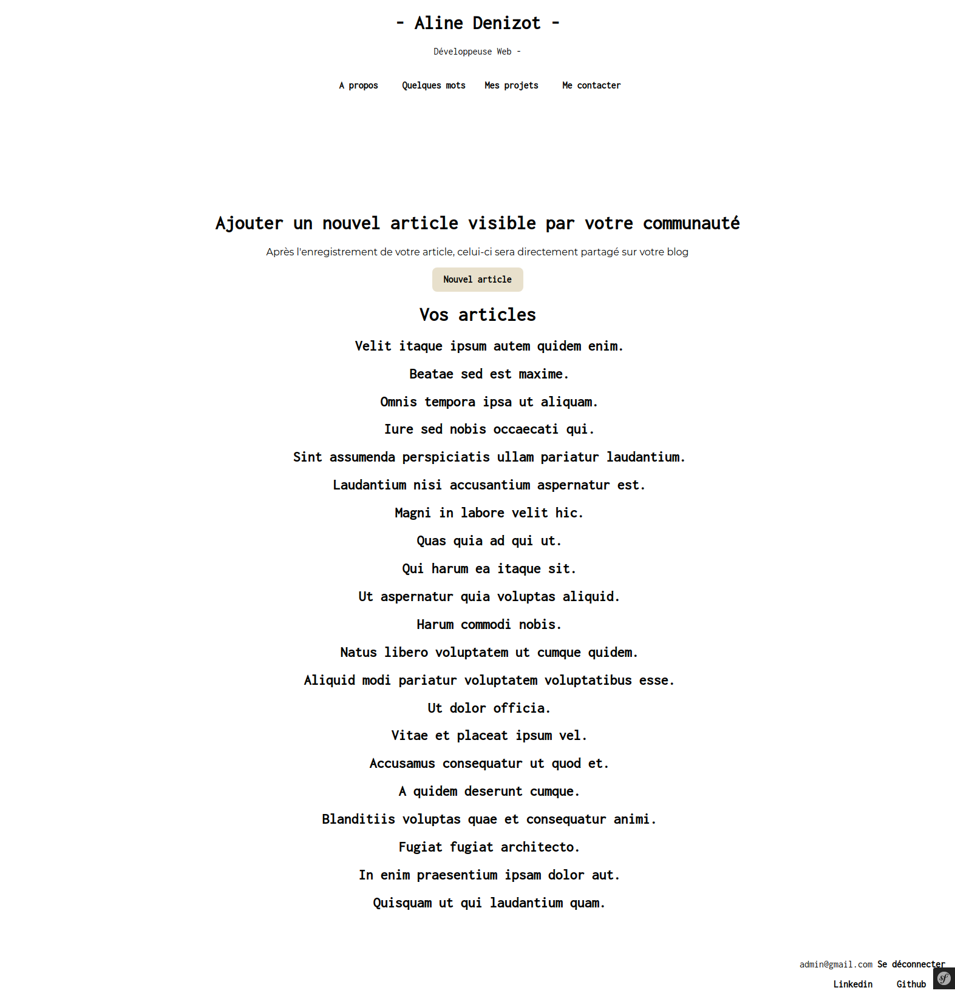
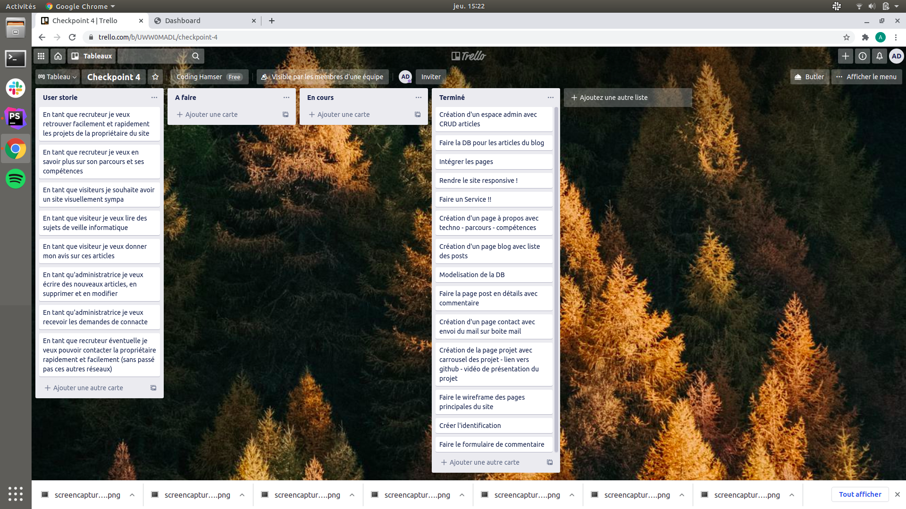
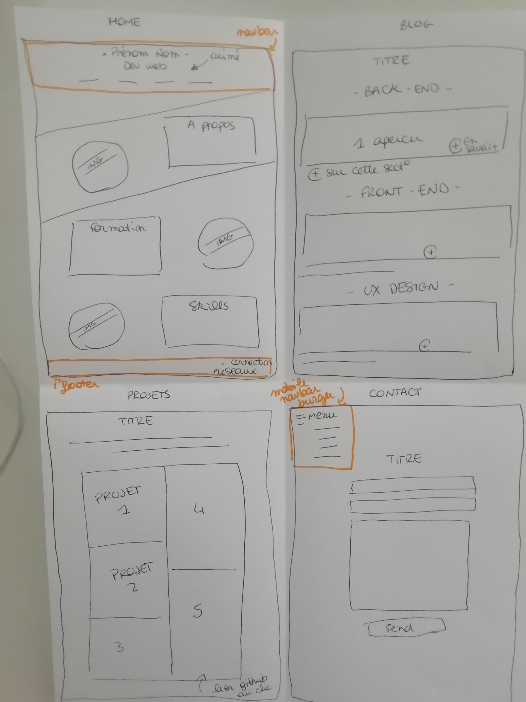
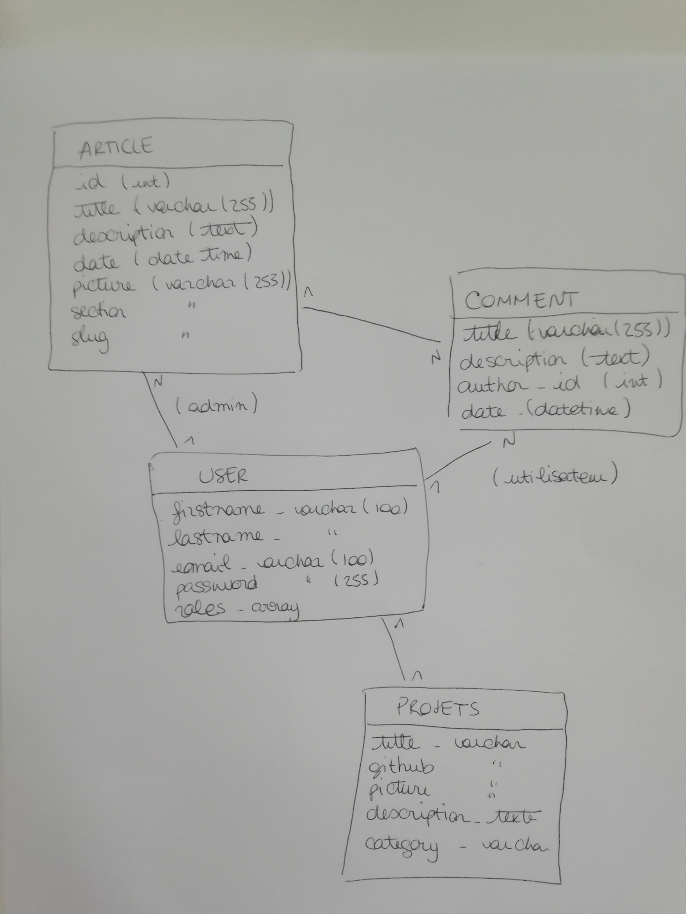

# Blog et portfolio 

Sité réalisé dans le cadre d'un checkpoint à la Wild Code School en 2jours (de la conception à la réalisation finale).  
Utilisation de Symfony avec Webpack Encore (SCSS).  
Partie blog : possibilité pour les utilisateurs connectés de déposer un commentaire et pour l'administratrice de déposer un nouvel article (via son dashboard).
Partie contact : transmission du contenu du formulaire par mail (installation Bundle Mailer).

# Screenshot des pages principales du site

* Projet réalisé en methode agile. Ci-dessous les backlogs & users story

* Réalisation d'un wireframe rapide

* Modélisation de la base de données

